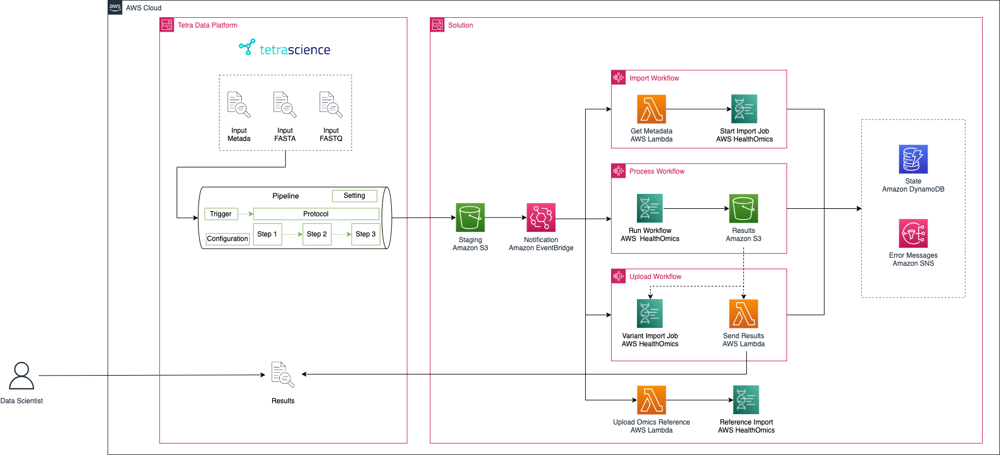
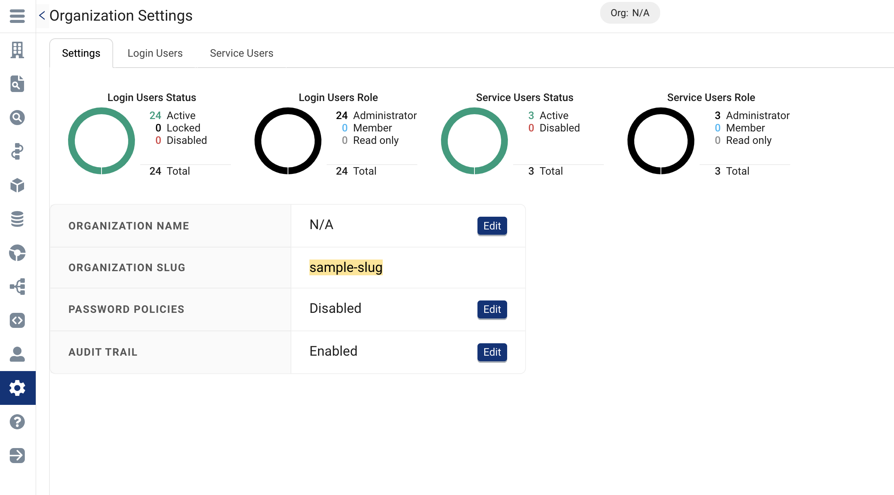
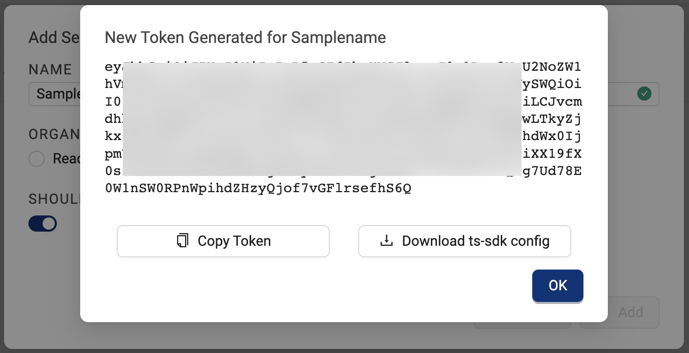
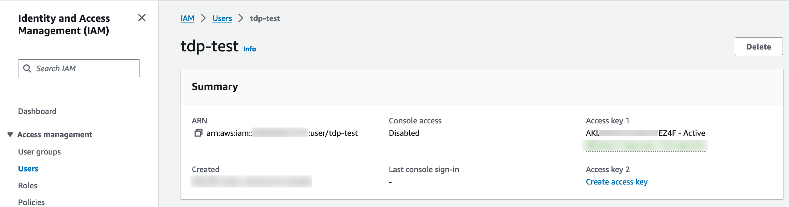
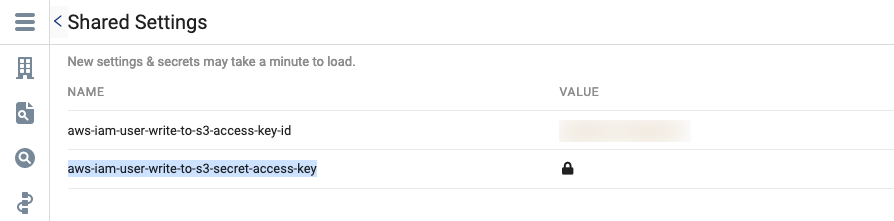
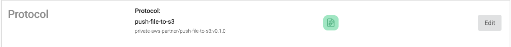
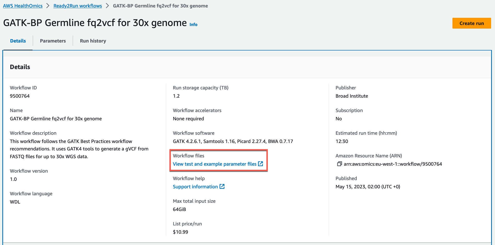

# Automated genomic data processing with AWS HealthOmics & TetraScience
This repository holds the Digital Lab solution that powers automated genomics processing engine for TetraScience and Amazon Omics.

## Summary of Solution
This repository accompanies this [blog post](https://aws.amazon.com/blogs) and demonstrates how to use [AWS HealthOmics](https://docs.aws.amazon.com/omics/latest/dev/what-is-service.html) along with [TetraSciences’ Scientific Data Cloud](https://www.tetrascience.com/platform/tetra-data-platform) (TDP) to make omics datasets available for downstream analysis while using TDP as the research data lake.  The HealthOmics workflows run in your own account, allowing you to take advantage of predefined workflows, or to define custom workflows for omics processing.



## Repository Structure

```bash
|-- App
|   |-- Lambda
|   |-- StepFunctions
|   `-- template.yaml
|-- README.md
|-- Resources
`-- sample_run_demo.mdata.json
```

### App
Contains all the application code including IaC. The repo has been setup with [AWS SAM](https://aws.amazon.com/serverless/sam/).  
### Lambda
Each subfolder contains a AWS Lambda function deployed with SAM
### StepFunctions
Each file contains a Step Functions statemachine definition deployed with SAM
### template.yml
Contains all the CloudFormation code
### sample_run.mdata.json
Definition for the metadata structure
### README.md
Explanation of the solution and setup

## Prerequisites
To run the solution, you should have the following prerequisites: 

- An AWS account with permissions to create AWS resources that are used in this blog
- Tetra Data Platform tenant (requires a subscription)
- [AWS SAM](https://aws.amazon.com/serverless/sam/) for solution deployment

## Solution Deployment
### TetraScience Setup
In order for the solution to communicate with TetraScience a service user needs to be setup for AWS to use. This service user will provide the credentials for AWS to publish updates back to TetraScience. 

When deploying the CloudFormation template you will be asked for three parameters:

1. `TDPToken`: This is the service user access token.
2. `TDPAPIEndpoint`: If your TDP URL is `https://xxx.tetrascience.com`, then the TDPAPIEndpoint URL is usually `https://api.xxx.tetrascience.com`. 
3. `TDPOrg`: This is the TetraScience org slug.

Follow the following steps to capture these details.
Start by opening the TetraScience console and navigate to **Administration > Organization Settings** or use following URI `/admin/organization?tab=settings`

Capture the org slug for the TDPOrg from this page as highlighted in the image below.


Secondly, we can create a new service user by going to the **Service Users** tab on the same page. Add a service user and specify the role as **Member**. You can decide whether you want the token to expire, we recommend you do expire the token on a yearly basis or more frequently. Instructions to do so are in the FAQ section.
Once created you are prompted a new token, copy this as your TDPToken parameter.


Once we have deployed the AWS setup we will come back to TetraScience for the final setup that will sync the files to AWS.

### AWS Setup
The AWS solution uses AWS SAM for the deployment, please make sure you have installed the AWS SAM CLI before starting. [Documentation](https://docs.aws.amazon.com/serverless-application-model/latest/developerguide/install-sam-cli.html)  
  
First we will deploy the solution, do this by navigating to this folder from your favourite terminal application. 
```
cd <PATH TO SOLUTION FOLDER>/App
# Make sure the SAM CLI is installed
sam --version
# Sam build creates the Lambda packages
sam build
sam deploy --guided
```
The guided deploy will ask you a set of questions:
1. Stack Name: The CloudFormation stack name you want to use, choose freely
2. AWS Region: Use any region that supports HealthOmics
3. TDPTOken: Provide the token we gathered in the TetraScience setup
4. TDPEndpoint: Provide the domain we gathered in the TetraScience setup
5. TDPOrg: Provide the org slug we gathered in the TetraScience setup
6. Confirm changes: Choose if you want to review the changes before they get deployed.
7. Allow IAM role creation: Choose Y, this is required.
8. Disable rollback: Choose if you want to block rollbacks if an operation fails.
9. Save arguments: Choose if you want to save the config we just setup. 


After the CloudFormation template has succesfully completed the deployment for AWS is complete. Setup TetraScience to publish files automatically to the AWS Solution.

### IAM User for TetraScience Pipeline

Create IAM user credentials to be used by the TetraScience pipeline to push data to S3.
Proivde user permissions to write to S3 bucket starting with `digitallab2-tetraomics-`




```
{
    "Version": "2012-10-17",
    "Statement": [
        {
            "Effect": "Allow",
            "Action": "s3:PutObject",
            "Resource": "arn:aws:s3:::digitallab2-tetraomics-/*"
        }
    ]
}
```

Put access key and secret of the IAM user into  **Shared Settings** in the TetraScience platform. 

## TetraScience Pipeline

Create shared settings 
- `aws-iam-user-write-to-s3-access-key-id` 
- `aws-iam-user-write-to-s3-secret-access-key` 

secrets under **Shared Settings**.



Use the configured secrets in your pipeline protocol `push-file-to-s3`. 



## Use the solution

The deployed solution expect a `*.mdata.json` file to be created in the `digitallab-tetraomics` S3 bucket to start a workflow run. 

Let's use the provided example `sample_run_demo.mdata.json` with the Ready2Run workflow `GATK-BP Germline fq2vcf for 30x genome`. 

```json
{
  "name": "DemoTetraTeam",
  "description": "Demo",
  "sequencer_platform": "illumina",
  "input_path": "/",
  "reference_genome": "digitallabhg38",
  "run_params": [
    {
      "platform": "illumina",
      "source1": "C0L01ACXX.1.5-percent.R1.fastq.gz",
      "source2": "C0L01ACXX.1.5-percent.R2.fastq.gz",
      "read_group": "C0L01ACXX.1"
    }
  ],
  "workflow": {
    "id": "9500764",
    "type": "READY2RUN"
  },
  "output": {
    "tetrascience": true,
    "variant_store": true
  }
}
```

### Import Reference Genome

In this example we use the `GRCh38/hg38` reference genome that can be downloaded at [Registry of Open Data on AWS](https://registry.opendata.aws/). As this is an one time operation, you may upload the reference genome directly to the S3 bucket. This will start the import of the reference genome. The file `hg38.fa` will create a reference genome in the reference store with the name `digitallabhg38`. 

### Upload Workflow Files

The description of the Ready2Run workflow `9500764` can be found [here](https://console.aws.amazon.com/omics/home?#/ready2run/9500764). 

To download example source files navigate to the Ready2Run workflow and select the link under **Workflow files**. 



Download the files and upload them to your TetraScience data lake to trigger the TetraScience pipeline. The pipeline will places the files onto the S3 bucket, which will finally start the Step Functions workflows. 